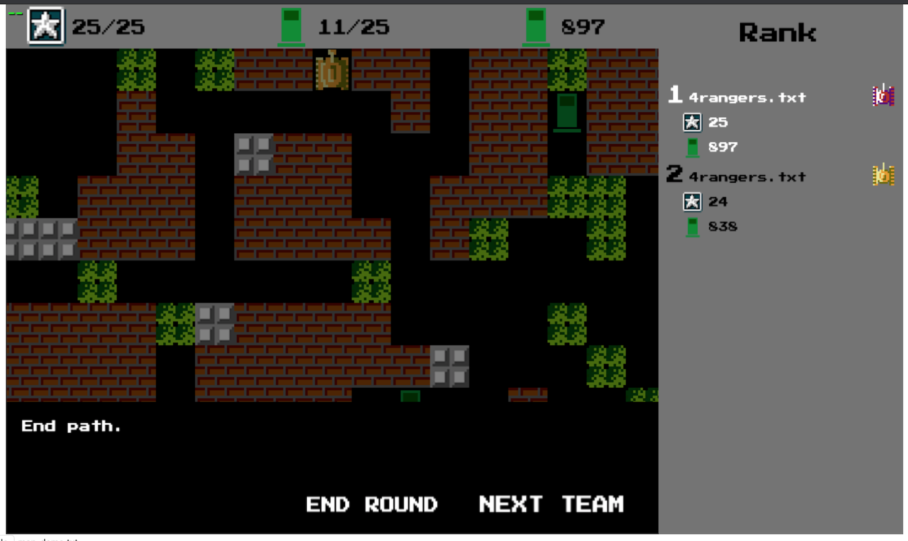

# FossilSummerCoding2020

### [Instruction](Instruction.pdf)

### Run
Edit the input and output inside run.sh
```bash
source run.sh 
```

### Visualize


[Link to visualize game](https://summercoding.herokuapp.com/?fbclid=IwAR3L2KsDn7u4sp7s1EWkum90oW87LS1PmHu0r85T0zbPer49XtWhT-uJKdA)

